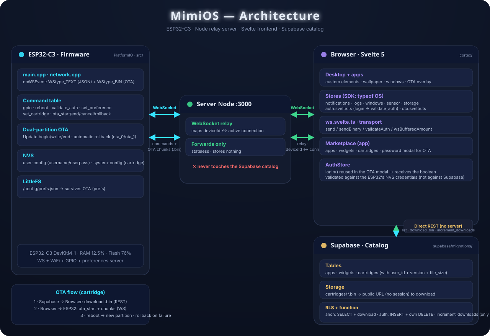

# Architecture

MimiOS connects an ESP32-C3, a Node relay server, a browser frontend (Svelte 5), and a Supabase catalog.



## Layers

```
ESP32-C3 (firmware)          Server Node (:3000)         Browser (Svelte)
┌─────────────────┐          ┌────────────────┐          ┌────────────────────┐
│ OS + apps       │          │ WebSocket relay│          │ "Desktop" + apps   │
│ NVS / LittleFS  │◄────────►│ deviceId↔conn  │◄────────►│ stores + ws.svelte │
│ OTA dual-part   │    WS     └────────────────┘   WS     │                    │
└─────────────────┘                                        │        │          │
                                                           │        │          │
                                             Supabase (catalog)     │
                                             apps/widgets/cartridges│
                                             + .bin in storage      │
                                             anon = SELECT/download │
                                             session = insert+delete│
```

## Data channels

- **Catalog**: the browser talks **directly** to Supabase (REST) — list apps/widgets/cartridges, download `.bin` files, call `increment_downloads`. The Node server never touches the catalog.
- **Device**: the browser only reaches the ESP32 through the WebSocket **relayed by the Node server** (`cmd` JSON for commands, binary frames for OTA chunks).

## Firmware (`src/`)

- `main.cpp` — boot, loop, services.
- `network/network.cpp` — WebSocket event loop, command table (`gpio`, `reboot`, `validate_auth`, `set_preference`, `set_cartridge`, `ota_*`), OTA state machine, NVS (`user-config`, `system-config`) and LittleFS (`/config/prefs.json`).

## Frontend (`cortex/`)

- 5 stores exported to the SDK: `notifications`, `logs`, `windows`, `sensor`, `storage` (`OSContext = typeof OS`).
- `services/ws.svelte.ts` — single transport layer: `send`, `sendBinary`, `validateAuth`, `wsBufferedAmount`.
- Apps are custom elements (`marketplace-app`, ...) driven by a manifest in preferences.
- OTA: `stores/ota.svelte.ts` + `components/ota/ota-overlay.svelte` + password modal in the marketplace.

## Server (`server/`)

Stateless WebSocket relay mapping `deviceId ↔ active connection`. It forwards frames between browser and device and holds no catalog data.

## Supabase

Tables `apps`, `widgets`, `cartridges` (with `user_id`, `version`, `file_size`). Row-level security: anonymous can `SELECT` + download; authenticated can `INSERT` and `DELETE` only their own rows; no one can `UPDATE`. The only write from the anonymous frontend is through the `increment_downloads` function.
